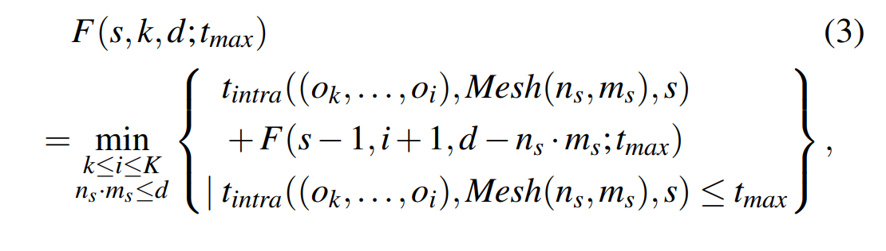
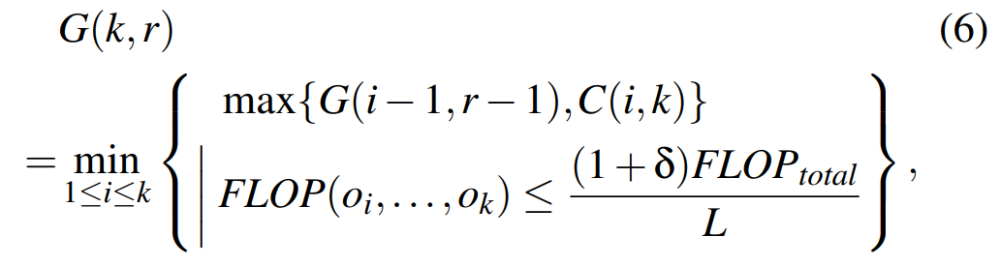

# Alpa: Automating Inter- and Intra-Operator Parallelism for Distributed Deep Learning

Alpa 将 **pipeline parallelism** 和**已有并行方法**相统一，提出 **intra-op** (data, model, ZeRO, etc) 和 **inter-op** (pipeline) 的**两级并行架构**。在 **intra-op level**，Alpa 通过**整数线性规划** (ILP, merge simple op) **优化 intra-op parallelism**，通过**通信量/带宽**来**评估通信 & reshard 开销**，**最小化 stage（包含多 OPs）在给定 device mesh 上的执行开销**；在 **inter-op level**，Alpa 基于 **intra-op pass 返回的 cost (estimated stage latency) 和 intra-op plan**，将 **stage-mesh pair 编译为可执行文件**，**profile** 以获得精确的 **stage latency，stage 所需内存和中间激励存储的所需内存**，通过一个**动态规划 (DP) 算法** (early-pruning & op clustering) 考虑**如何切分模型/设备集群为 stages/device meshes**，和**如何映射为 stage-mesh pair**，**最小化 end-to-end pipeline latency**。

---------

###### Part 1. Introduction

- 已有并行工作的局限：要么被**限制在单个并行**方法 (PipeDream)，要么**依赖于对模型和集群规格的强假设** (DAPPLE, Tofu)。**自动混合并行的搜索空间较复杂**，多并行策略的**实现不够灵活**。例如，若数据并行和 OP 并行结合，则添加一个 worker 需要额外分配多个设备；同时，**最优的流水线策略依赖于每个 stage 数据和 OP 并行的决策，以及设备分配**。因此，先前工作**大部分局限于将数据并行和至多一类并行方法结合**；
- **Key observation**：可以将**不同并行策略**组织为一个**多级空间**，并将这些并行策略映射到**计算集群中的多级结构**。**不同并行策略对通信带宽要求不同**，这与**集群中不同位置设备间的带宽不同**相一致；
- **多级并行策略的好处**：1) **intra-op** 并行的**硬件利用率更高**，但会在每 iter 带来 **OP 切片间的更多通信**，以及**划分 OP 后的合并**；2) **inter-op** 并行**仅在相邻 stages 间通信**，若适当划分则**轻量**，但会导致**设备的 idle 时间**。Alpa 将 **intra-op** 映射到**高带宽设备**，将 **inter-op** 映射到**距离较远的低带宽设备**，并**分级近似最优优化**，**全局非最优**但性能较好；

---------

###### Part 2. Intra-op Parallelism

- 定义：以 **stage 为单位**，包括**多个 OPs**（计算图的子图，部分 OP 由多个轻量 OP 合并得到），由 inter-op pass **给定 device mesh**。OP 粒度上，Alpa 以 **SPMD-style 方法**将 **stage 内的 OPs 在 mesh 内的多个设备上均匀划分**，并在**多设备上执行相同指令集**；将 OP 对应 **tensor** 沿某些维度划分为 **tiles**，分配到 **mesh 内的多个设备上计算**，同时**执行相同 OP 的不同部分**。
    - 数据并行沿 tensor 的 batch 维度划分，因此属于 intra-op 并行。
    - **相同 mesh 内的设备算力相同**，OP 在多设备上均匀划分可以显著缩减 intra-op plan 的搜索空间，同时也可以方便地表示 DP、ZeRO 在内的多类并行方法。
    - Intra-op pass 的返回结果为**每个 stage-mesh pair 的 intra-op plan** 和**相应的 execution cost (estimated stage latency)**。
    
- 几个概念：
    - **Device mesh**：多个设备的 **2D logical view**，mesh 内所有设备的**算力相同**。沿**同一 mesh 维度上的设备间可以拥有不同的带宽**，但**同一 mesh 维度上的相同组内的设备间带宽相同**。例如，1 个 machine 有 2 个 nodes，各自有 4 个 GPUs，则 device mesh 的 shape 可以为 1*8，但不同 nodes 上的 GPUs 各自形成 devices group，group 内带宽相同。 
        - **相同 group 内 devices 的通信有更高的带宽**，更适合 **OP 划分后各子部分进行 DP**（参数同步通信量更大），因此排在一起是合理的；
        - **可选 Shape 的限制** (from inter-op pass)：为了充分覆盖 cluster mesh (shape N*M)，不浪费计算资源，提供了理论证明。
            - 1D mesh: (1, 1)、(1, 2) …… (1, M)；
            - 2D mesh: (2, M)、(3, M) …… (N, M)；
                - 完整占用 cluster mesh 的第二个维度，即占用一个 machine 内的全部 devices；
        - 从 devices 到 device mesh logical view 的映射由 inter-op pass 优化，包括 **mesh shape 在动态规划算法中的选择**，以及**将 physical devices 分配进 device mesh 的方式**。
    
    - **Sharding spec**：**对 tensor layout 的定义方式**。对于 N 维 tensor，其 sharding spec 被定义为 $X_0X_1 \cdot\cdot\cdot X_N$，其中 $X_i = \{S,R\}$，S 表示沿该维度 partition，R 表示沿该维度 replicate。
        - 同时，通过每一 **S 维度的上标**来表示 **mesh 内设备和 tiles 的映射关系**。以二维 tensor，2*2 设备 mesh 为例，S^0R 表示沿 row 划分一次，并沿 mesh 的 0-axis 切分，一半 devices 为 tensor 的一半，另一半为另一半。
            - **S 表示的 tensor 切分次数与上标位数有关**（比如 $S^{01}R$ 即沿 row 切为四份），而**上标可用位数和 mesh 维度及设备数有关，最多为 2 位**（device mesh 为 2D）；
                - 这样，限制 device mesh 为 2D 等于是限制了单个 tensor 无论多少维，都最多只能切成 4 份，但可能对超大型 tensor（例如某个超大 OP 的 input tensor）不太友好？因为相应的，所有 OP 并行的并行度最多也只能是 4，可能不太够。
        - **一个 tensor dimension 能对应多个 mesh dimensions**（$S^{01}RR$，仅在 tensor dim_1 切成四份，然后分别在 mesh dim_1 和 dim_2 均匀分布和 replicate），**一个 mesh dimension 仅能对应一个 tensor dimensions**（$S^0S^0R$ 不合理，因为 inter-op pass 会在决定 mesh shape 时将该方案转换为 $S^0S^1R$）。
    
    - **Resharding (layout conversion)**：当**某个 OP 的输入 tensor 不符合该 OP 的 sharding spec 时进行**。根据 **cross-device 通信的方式**可分为三类：
        - **No communication**：例如 $RR \rightarrow S^0S^1$，切分不需要通信，只要舍弃每个 device 上的部分参数；
        - **All-gather**：例如 $S^0R \rightarrow RR$，把划分后的模型块 gather 成完整的；
        - **All-to-all**：例如 $S^0R \rightarrow RS^0$，mesh 不同划分区域内的 devices 间互相交换部分参数，但并没有 gather 在一起。
    
    - **OP 的并行策略**：类似 tensor，**对部分维度进行 partition，其他维度进行 replicate**。根据**是否需要 cross-device 通信**也可分为两类（以 batched matmul $C_{b,i,j} = \sum_k A_{b,i,k}B_{b,k,j}$ 为例）：
        - **No communication**：划分后每个部分可单独计算，即每个设备有全部所需的输入 tiles，则无额外的通信开销（例如沿 i、j 或 b 维度划分）；
        - **All-reduce**：需要用 all-reduce 来将 partial sum 的结果聚合在一起（例如沿 k 维度划分，没有完整的将 A 的一行和 B 的一列做矩阵乘，而是各自的一半）。
    
        Intra-op pass 中，模型图被表示为 [**XLA 的 HLO 格式**](https://blog.csdn.net/weixin_45387966/article/details/121994883)，将常见的 DL OPs 总结为 80 个不到的原语 OPs，所以可以**人工枚举每个原语 OPs 可能的并行策略**。
    
    - 一个例子：对于矩阵乘操作，可以并行 loop i，loop j，loop k 或它们的组合，这会带来不同的计算和通信开销，需要输入 tensors 的不同 layout，并带来不同 layout 的输入 tensors。此时，若输入 tensor 不满足 layout 要求，则需要进行 reshard，这会带来额外的通信开销。
    
- 整数线性规划 **ILP Formulation**：
    
    - **cost 模型**：类似 Tofu，由于 Alpa **对大 OP 进行均匀切分**，所有的并行方法有**相同的算数复杂性**；同时，**小 OP** 设备间存在的部分**重复计算开销可忽略**。因此，Alpa 仅关注**通信开销**和 **reshard 开销**，而**非计算开销**。在 **intra-op pass** 中，不对通信开销和 reshard 开销进行 profile，而是用**通信量 / 带宽来评估**；
    
    - **目标函数**：最小化图内**所有节点的通信开销和所有边的 reshard 开销之和**。
        $$
        \min_{S} \sum_{v \in V} s^T_v (c_v + d_v) + \sum_{(v,u) \in E} s^T_v R_{vu} s_u
        $$
        其中，$c_v$ 为通信开销，$d_v$ 为可忽略的计算开销，$R_{vu}$ 为 resharding cost matrix (v -> u)，$s_v$ 是 OP 并行策略的 one-hot 选择向量。对于 reshard 开销中存在的二次项 $s^T_v * s_u$，Alpa 引入新的决定向量（长度为 sv 和 su 的长度之积）来降次，进而用已有的求解器进行优化。
    
    - **图简化**：Alpa 将**轻量 OP 合并**，通过 **BFS 确定并合并到深度最深的 OP**。原因是推迟到最后的 depth 才计算，防止跨分支 merge 时出现依赖关系紊乱（例如分支 A 上已经执行到了，但分支 B 还没，此时执行 merged OP 显然不合理）。此外，和 ZeRO 类似，将 **all-reduce 拆分为 reduce-scatter 和 all-gather**，在 mesh 内共享优化器状态、梯度和参数，以**节约内存**。

------------

###### Part 3. Inter-op Parallelism

- 定义：不进行 OP 划分或 replicate，而是将**不同 OPs 组织为 stages**，分配到**由 cluster mesh 切分的不同 device meshes 上执行**，映射为 **stage-mesh pair**。Alpa 使用**同步 1F1B 调度**作为 **pipeline 策略**，该方法保留了同步一致性，且相较于 GPipe，保持 pipeline 延迟相同的同时，峰值内存开销更低。

    - Pipeline stages 间进行设备间的**点对点通信**，所需**通信量远小于 intra-op parallelism**；由于 **stages 间的数据依赖**，会导致**部分设备在 fp/bp 过程中存在 idle time**；
    - 先前工作假设**每个 stage 的设备是预先分配好的**，且**所有 stages 有固定的 intra-op plan**；
    - Inter-op pass 基于**模型图的拓扑顺序**（简单实现为 model IR 中 users 如何定义每个 OP 的顺序）进行**模型图的线性化**。

- 几个概念：

    - **最小化 end-to-end pipeline latency 的目标函数**：基于 **intra-op pass 报告的 t_i**，inter-op pass 构造最小化端到端流水线延迟的目标函数，包括**所有 stages 的总延迟**（第一个 microbatch 经过 pipeline 后的延迟）和**剩下 B-1 个 microbatches 的 pipelined 执行时间**（取决于最慢的 stage）。
        $$
        T^*  = \min_{s_1, ..., s_S; (n_1, m_1), ..., (n_S, m_S)} \{\sum_{i=1}^S t_i + (B-1) \cdot \max_{1 \leq j \leq S} \{t_j\}\}
        $$

    - **目标函数的约束条件**：

        - 将一个 OP 的 **fp 和 bp OP 放在同一个 mesh**，原因是 **bp 通常会使用部分 fp 相同的 tensors**，减少通信量；
        - 切分 device meshes 来**完全覆盖 N*M 的 cluster mesh**，以避免浪费计算资源。 

- 动态规划 **DP Formulation**：Alpa 使用 DP 来求解**最优的 stages 划分 S 和 mesh 划分**，目标是**最小化 end-to-end pipeline latency T**。 

    - DP 仅优化 submeshes 的 shape，不负责往 meshes 里分配 physical devices，后者**优先将 devices 分配到更大的 meshes**；当存在多个 stages 的 submeshes shape 相同时，**优先让相邻 stages 在设备 mesh 上更近**；
    - 为了保证 submeshes 可以完全覆盖 cluster mesh，算法限制了 device mesh 的可选规格 (见 Part 2)。

    算法可以分为两步：

    1. **枚举 T 的第二项 $t_{max} = \max_{1 \leq j \leq S} \{t_j\}$**，并**对不同的 $t_{max}$ 最小化第一项 $t_{total}(t_{max})$** 。具体来说，通过一个**函数 $F(s,k,d;t_{max})$ 的最优子结构**，以 DP 的方式**确定最优的 $T^*(t_{max})$**。注意，在该最优子结构中还要**枚举 mesh shape**，并**对每个选择访问 intra-op pass** 来**获取 ILP 优化后的 intra-op plan**。

        - 该函数表示当将 OP $o_k$ 到 $o_K$ 划分到 $s$ 个 stages，并分配 $d$ 个 devices 时的最小 total latency，从定义 $F(0, K+1, 0; t_{max}) = 0$ 开始。

        
        $$
        T^*(t_{max}) = \min_s \{F(s,0, N \cdot M; t_{max})\} + (B - 1) \cdot t_{max}
        $$
        其中，**$t_{intra}((o_k, ..., o_i), Mesh(n_s, m_s), s)$ 是子图 $(o_k, ..., o_i)$ 在待划分的 mesh $Mesh(n_s,m_s)$ 内，将子图 $(o_k, ..., o_i)$ 划分为 s 个 stages，并将 $Mesh(n_s, m_s)$ 相应划分为 s 个 submeshes 后，执行这些 stage-mesh pairs 的最低延迟**，由 intra-op pass 返回，同时返回的还有子图内各 stage-mesh pairs 的 intra-op plan。

    2. 获得该选择的 intra-op plan 后，inter-op pass **将子图按该 plan 编译为可执行文件**，运行 **profile** 以获得**精确的 stage latency**，**运行 stage 所需的内存**，以及**存储中间激励所需的内存**，并**判断能否在给定设备上运行**（内存是否可行，将不同类型的设备往里面填，看有没有可行的），进而**选择 stage latency 最小，且内存满足设备要求的 mesh shape**。

    - 注意，**Alpa 假设输入 micro-batches 的 size 相同**。

    - **算法优化**：DP 算法的复杂度较高，对 1w 个以上的 OPs 是不可行的，因此引入两类优化方法：

        - **Early Pruning**。和 TeraPipe 类似，从**小到大地枚举 $t_{max}$，当 $B\cdot t_{max}$ 大于当前最优的 T* 时停止枚举**，因为无法找到更优的方法（T 等于 $B \cdot t_{max}$ 再加上另外的 stage latency）；同时，我们递增 $t_{max}$ 时**每次增加一个固定量 $\varepsilon$**，这样可以保证算出来的 T 和全局最优 T* 最多差 $B \cdot \varepsilon$。

        - **OP Clustering**。将**相邻 OPs 合并为一个 layer，以减小图规模**。合并目标包括两类：1) **计算量较小的 OP**；2) **若放置在不同设备 meshes，会带来连续通信的相邻 OPs**。我们将**函数 G(k,r)** 定义为**前 k 个 OPs 合并到 r 个 layers 的多种方式中单个 layer 数据接收量最少的那个方式**，并设计其**用于 DP 的最优子结构**，包括**防止单个 layer 内的 FLOP 数目显著高于 layers 平均 FLOP 数目的约束**。若存在两个通信开销相同的方案，则**最小化每个 layer FLOP 的方差**，以获得更加平衡的结构。L 是 DP 算法的超参，一半根据设备数和大计算量 OP 的数目来决定。

            

----------------

###### Part 4. Runtime Orchestration

- Workflow：Alpa 依次设计了 **inter-op pass**、**intra-op pass** 和 **runtime orchestration** 三类 pass。
    - 给定 **Jax IR 的模型描述和集群配置**，inter-op pass 将 **IR 切分为多个 stages**，将**设备集群切分为多个 device meshes**，并通过**动态规划 (DP) 将 stages 分配到 meshes**，并**对每个 stage-mesh pair 激活 intra-op pass**。
    - 被激活后，intra-op pass 通过**整数线性规划 (ILP) 来最小化 stage 执行开销**，优化 **stage-mesh pair 的 intra-op plan**，并**将 plan 和开销反馈给 inter-op pass**。
    - 随后，inter-op pass **基于 intra-op plan 编译并执行 stage-mesh plan**，获取**精确的 stage latency**，**运行 stage 所需的内存**，以及**存储中间激励所需的内存**，并**基于 cost 和内存情况通过 DP 最小化 pipeline 的 end-to-end latency**，以获取 stages 和 meshes 的最优划分方案。
- 在 stage level，Alpa **基于 XLA 和 GSPMD 进行编译**，为每个 stage-mesh pair 生成并行可执行文件，并在需要的时候**插入通信原语来处理 mesh 内通信**；在 intra-op level，Alpa 实现了一个**并行编排 pass**，来解决 **cross-mesh 的 stages 间通信**，并**为 inter-op 并行执行生成静态指令**。
- **Cross-mesh Resharding**：现有的人工 pipeline 系统要求 stages 有相同的 DP 和 MP 并行度，并将 stages 间通信简单实现为相同 meshes 间的 P2P send/recv。
    Alpa 中，**包含两个相邻 stages 的设备 meshes 可能有不同的 mesh shapes**，且 **stages 间通信的 tensor 可能有不同的 sharding specs**，将这类通信模式定义为 **cross-mesh resharding**，一个**多对多的多播问题**。给定 sender 和 receiver mesh 上 tensors 的 sharding specs，Alpa 生成一个**通信方案**，从两步迭代来解决 cross-mesh sharding：1) Alpa **计算 src 和 dst mesh 间 tiles (tensor partitions) 的对应关系**，生成 **src 和 dst 设备间的 P2P send/recv 原语**；2) **识别 dst tensor 的 sharding spec 中是否包含 replication**，若包含则 tensor 仅需要向 dst mesh 传一次，并通过 **all-gather 在 mesh 内的 devices 上以更高的带宽交换**，该方法叫 **local all-gather**。由于 stages 间的通信量较小，Alpa 未考虑 cross-mesh resharding 的优化。
- **生成 pipeline 执行指令**：最后一步，Alpa **生成静态执行指令来 launch 训练**，使用一个 **MPMD-style 的 runtime 来编排 inter-op 并行执行**，为**每个设备 mesh 单独生成静态执行指令集**，包括 stage 内 tensors 的内存分配和去分配，stages 间按 cross-mesh resharding plan 的 tensors 通信，同步和计算等。根据 user 选择的 pipeline schedule，Alpa 使用一个 driver process 来在执行前提前生成指令并分发给各 worker，以避免 runtime 时 driver-worker 的协同开销。

-------

###### Part 5. Pros and Cons

Pros：

- Pipeline stages 可以包含数目和类别不等的 OPs 或 layers；
- Stages 可以被映射到不同 shapes 的 device meshes 上；
- 对每个 stage 来说，数据和 OP 并行的配置可以对每个 OP 分别自定义，以 OP-by-OP 的方式。

上述优势让 Alpa 将已有模型并行方法统一，并适用于更加异构的模型结构和集群配置。

Cons：

- 没有建模**不同 stages 间的通信开销**；
- Inter-op pass 中的超参 B（micro-batches 数目）未优化；
- Inter-op pass **将 pipeline 并行建模为静态线性调度，没有考虑更加动态的调度**，例如将计算图中的不同 branches 在不同设备上并行；
- **没有优化通信和计算混叠的方案，仅适用于静态计算图**（所有 tensor shapes 在计算时已知）

--------

###### Part 6. Conclusion

这篇 paper 最 fancy 的地方在于 **intra-op 和 inter-op 的两级并行架构**，**intra-op 中对已有模型并行方法的统一优化**，以及 **inter-op 最小化 end-to-end pipeline latency 的 DP 算法设计**。
