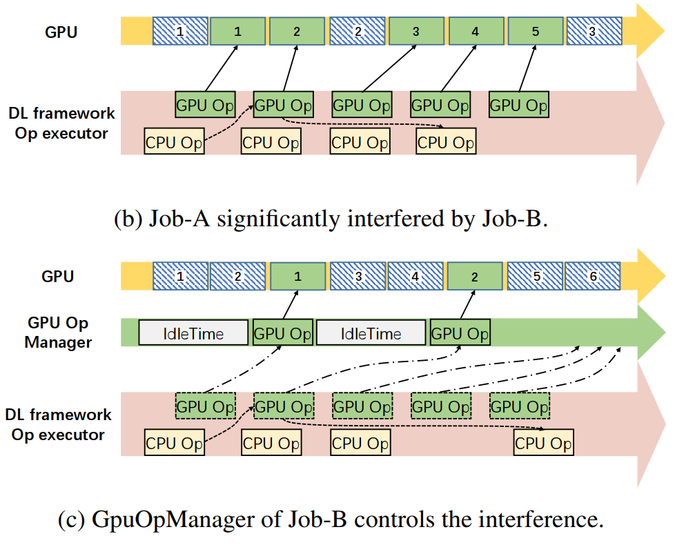
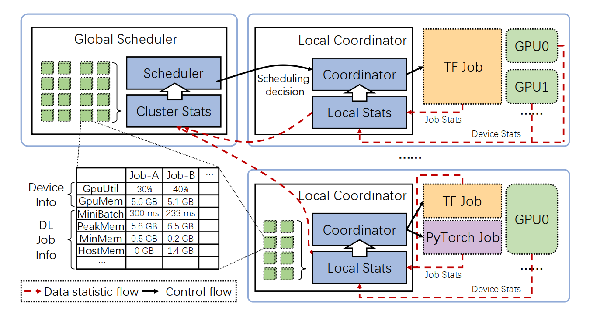

# AntMan: Dynamic Scaling on GPU Clusters for Deep Learning

AntMan 是一个 **co-design cluster scheduler 和 DL 框架的深度学习架构**，利用 DL training 的特性，在 **local coordinator** 中引入 **memory 和 computation 动态 scale 机制**，收集 **DL 框架和硬件的相关信息**，利用 **GPU Operator Manager 动态管理 Resource-Guarantee (RG) jobs 和 Opportunistic (OT) jobs 执行流的 GPU sharing**，避免对 RG jobs 的性能干扰；在 **global scheduler** 中为每个用户**维护一个支持 job arrival 的队列**，并分别**以不同的策略调度 RG jobs 和 OT jobs**，从而**分配 GPU 资源** (GPU 内存，计算单元)。

--------

- Motivations: 

    - 集群 GPU 利用率低下；多 jobs 群组调度 (gang-scheduling) all-or-nothing，导致大量资源空等待；DL job 执行流中所需资源量动态周期变化
    - Jobs 总是根据其峰值需求来请求资源，否则其性能 & JCT 会被影响，这导致了资源低利用率
    - 现有 DL 框架的 memory caching 设计也掩盖了 memory 的时序变化，阻碍 GPU memory 共享
    - Over-subscription 虽然可以提升集群吞吐和利用率，但可能会导致资源竞争 & 性能损耗
    - DL job 仅很少一部分的 GPU memory 被用于存储模型，大部分都在 mini-batch 中被分配和释放，以此往复；同时，大部分 job 的 mini-batch 都很短

- **Resources Dynamic Scaling**: 

    - 均在 **mini-batches 边界** (资源使用量最低点) 进行

    - **Memory Management**：AntMan 通过监控 mini-batch 中的 app 性能和内存需求，**scale GPU 内存上限**，甚至可低于需求。**当 GPU 内存不够时，tensors 被分配 (直接生成，从 GPU 算然后传到 host 内存) 到 host 内存**，会产生**多 mini-batches 下可忽略的性能开销**。在下一个 mini-batch 边界，尝试提高 GPU 内存上限，以将 tensors 分配回 GPU 内存。类似于 OS 里的分页 (Paging) 机制

        - 注意，这里 memory brust 在一般的 training process 里的 mini-batch 内不会发生，只会在 user-defined 的 validation (一般会使用更大的 batch size 来进行 validation) mini-batch 内发生。因此与 training process mini-batches 间的周期规律性和可预测性不矛盾。

        

    - **Computation Management**：Co-located jobs 间的**性能干扰**主要由 **GPU kernel queuing delay** 和 **PCIe bus 竞争**产生。

        - 现有 DL 框架在 GPU kernels 的依赖都满足时将 kernels 直接发，这导致虽然混布两个 job 能提高利用率，但会影响原来 GPU kernels 的执行流，进而影响 job 性能。

        AntMan 引入 **GPU Op Manager 模块**，持续 **profile Op 执行时间**，进行**细粒度的 GPU kernels 管理**。GPU Op 准备好时不直接发，而是**加入 manager**，进而通过**推迟 kernel 执行实现发射频率的管理**，**限制  OT job 的 GPU util**

        

- **Architecture**：

    - **两类 jobs 类型**：

        - **Resource-guarantee (RG) job**：消耗部分 GPU 资源，需要保证其性能和单跑时基本一致 (**mini-batch time 来作为性能的量化指标**)；
        - **Opportunistic (OT) job**: 无固定消耗的 GPU 资源，steal idle GPU cycles 以最大化利用率.
        - 也支持用户指定 job 类型，一般将 debugging 和超参搜索任务指定为 OT mode 来避免排队，以 early feedback。

    - **两级调度架构**：

        - **Global Scheduler**：为每个用户**维护一个支持 job arrival 的队列**，并分别**以不同的策略调度 RG jobs 和 OT jobs**，从而**分配 GPU 资源** (GPU 内存，计算单元)
        - **Local Coordinator**：引入 **memory 和 computation 动态 scale 机制**，收集 **DL 框架和硬件的相关信息**，利用 **GPU Operator Manager 动态管理 Resource-Guarantee (RG) jobs 和 Opportunistic (OT) jobs 执行流的 GPU sharing**，避免对 RG jobs 的性能干扰

        

    - **目标**：AntMan 的首要目标是保证多用户公平，其次是提高集群利用率以达到更高吞吐

    - **两类调度策略**：

        - For **RG jobs**：
            - 给定充足的 GPU 资源，scheduler 会公平地为 RG jobs 分配资源，并使用空闲资源最大化性能.
            - 若某个 RG job 的资源需求仅能被部分满足 (resource quota 量不够/ resource fragmentation 拓扑结构不满足)，scheduler 会为其 **reserve 这部分资源**，并等待其他 jobs 完成以进行群组调度. 
                - 注意，reserved 资源不会被其他 RG jobs 占有，但可以被 OT jobs 所利用。
        - For **OT jobs**：
            - Scheduler 会评估未分配 GPU 的 jobs 的排队时间，并将**长时间排队**的 jobs **自动转化为 OT jobs**.
            - **一段时间内 GPU 利用率低于 M 的 GPU 被选为候选者**，尽管有其他 jobs 在该 GPU 上跑。使用一个**启发式策略来将 OT jobs 分配到最空闲的候选 GPU 上**。
            - **如何 runtime 避免 RG jobs 被其他混布 jobs 影响**？在不影响 RG jobs 性能的情况下动态调整相同 GPU 上 co-located RG job (最多一个) 和 OT jobs 的 **GPU 内存上限**和 **SM 使用率 (通过 GPUOpManager 发射 kernel 频率来控制)**。
            - **RG jobs 所需资源激增**时，先临时利用 memory dynamic scaling 将部分 tensors 生成到 host 内存中，再逐步减少 OT jobs 的资源量，提高 RG jobs 的资源上限以恢复其性能。
            - **Reserved GPU 资源空等待时被多个 OT jobs 占用**，采用一个简单的启发式方法，**分配 GPU memory 给能获得最大性能的 jobs**，通过一个 trial-and-error 分配来实现。
                - 启用动态扩展机制后，我们发现不同工作负载在内存限制造成的性能下降上表现出不同的敏感性。
            - 资源充足时尝试 upgrade 为 RG jobs.

