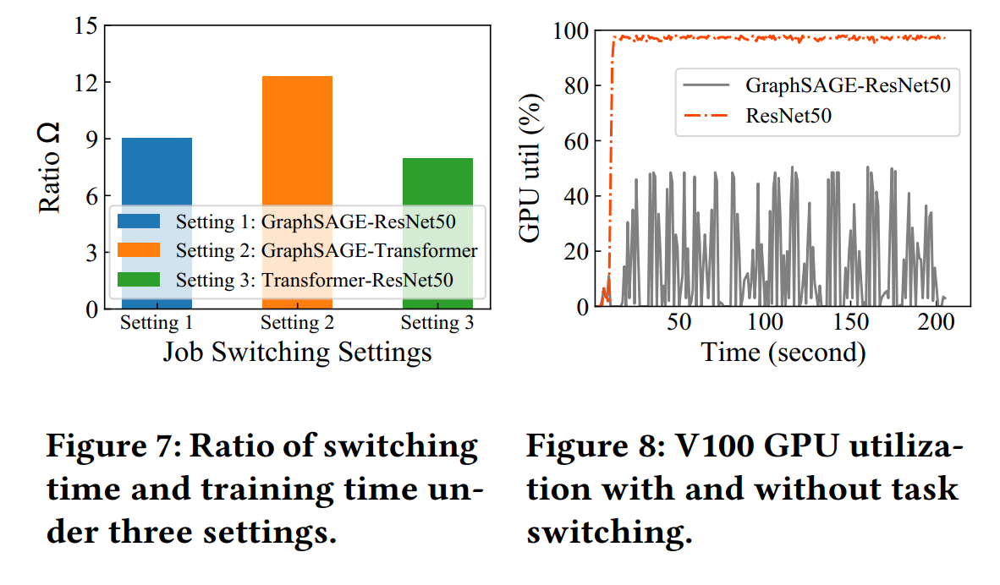

# Hare: Exploiting Inter-job and Intra-job Parallelism of Distributed Machine Learning on Heterogeneous GPUs

本工作**与 model slice 无关，是针对多 jobs slice 出来的 tasks 在异构集群中的调度方式**。Inter-job parallelism 指不同 jobs 的 tasks 在多个异构 GPUs 上并行；intra-job parallelism 指相同 job 的 tasks 在多个异构 GPUs 上并行。

Hare 是一个可以**在异构 GPU 集群中探索 inter-job 和 intra-job 并行方式的 job 调度器**，包括：

(1) 利用 DML 调度的特性优化 GPU 执行环境以**减少 task 切换开销** (借鉴 **PipeSwitch** (pipeline model 传输和执行 + 预创建 CUDA context)，**early task cleaning** 在每个 layer 后向完成后即清理，**speculative memory management** 保存 task seq 中已训练完单后面还有相同 job 的 task 的 data)；

(2) 一个 **relaxed scal-fixed** (其实就是同步 PS) 的同步策略，允许相同训练轮次内独立 tasks 被灵活调度 (支持抢占)；

(3) 一个考虑 job 特性和硬件异构的**快速启发式调度算法**，以**最小化 total 加权 JCT**. (数学建模推导较多，后面可以看一下).

-------

### 1. Archetecture

Hare 被**集成在参数服务器框架**下，分为 **task scheduler** 和 **executor** 两层架构，以及 offline preparation 和 online training 两个 stages。

- **Offline preparation stage**: task scheduler 获取 job info 和 hardware info，调用 **profiler** 试运行以获得不同 GPU 上的 task 执行时间，并维护 **profiling  database** (基于部分 jobs 重复提交的事实)。随后，scheduler 调用**调度算法** (最小化 total weighted JCT) 生成 **per-GPU task sequence** 并发送给 executor

- **Online training stage**: executor 基于收到的 task seq 调度 tasks 并读取 checkpoints，在 task 完成时发送梯度到参数服务器以聚合，并应用 memory controller 来实现快速 task switching，以实现抢占。

----------

### 2. Switching Cost

**Switching cost 远高于 mini-batch time**，且由于**大多数时间花在了 CUDA env cleaning 和 creation 上**， **GPU 利用率远低于运行单个 task**。

-------

### 3. Relaxed Scale-fixed Synchronization Scheme

不用等到相同数目的 GPUs 空闲，而是插空并部分 tasks 串行。

- 这和之前定义的 scale-adaptive 有啥区别？task 算完要等其他同 job 的 tasks 算完再同步。所以 scale-adaptive 和 relaxed scale-fixed 的区别就是异步 PS 和同步 PS 的区别？

注意，**这里相同 job 内 tasks 长度不同是因为 GPU 异构性，而非 uneven slice**.

