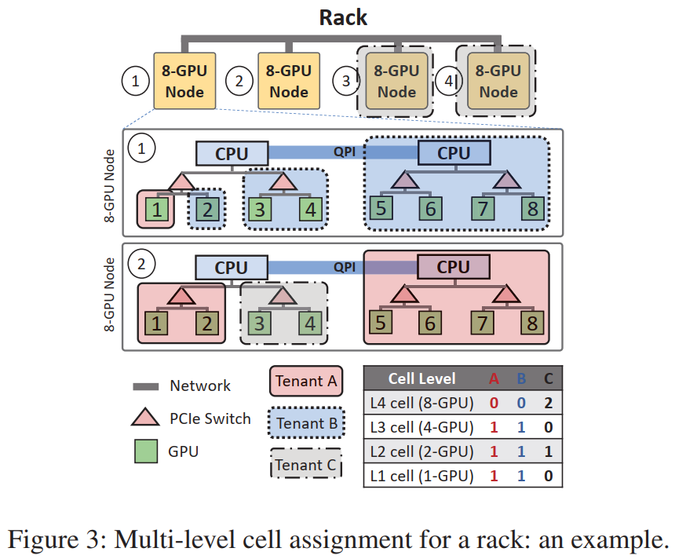
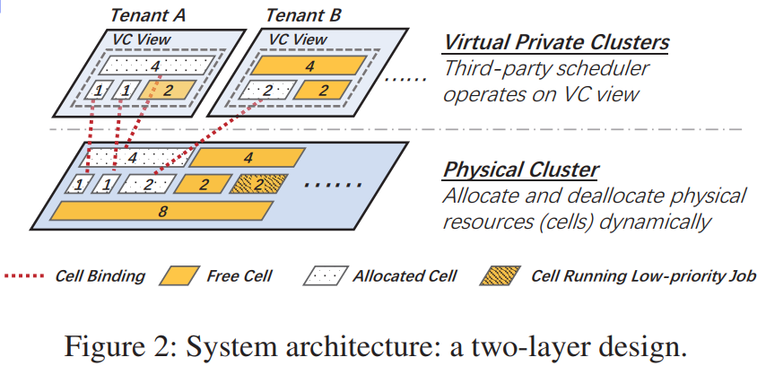

# HiveD: Sharing a GPU Cluster for Deep Learning with Guarantees

背景：多租户集群中的 jobs 面临更长的排队延迟，原因是租户**使用 quota (GPU 数目) 来 reserve 资源**，而这**无法保证 GPU affinity 需求 (网络拓扑和通信带宽)**，导致**更长的排队延迟** (资源需求类型为 guaranteed) 或**更差的模型训练性能** (relaxed affinity, 资源需求类型为 best-effort)。

HiveD 是一个**支持安全共享 GPU 集群的资源 reservation 框架** (面向 **K8S** 实现)，同时具有**私有集群的资源独立可用性**，和**共享集群的高利用率和资源用量动态可扩展性**，**在 VC 内应用已有调度器**进行考虑 affinity 的资源调度 (考虑集群利用率，JCT 等目标)，本身**专注于资源 reservation 机制** (如何构建并部署 VC，即如何构建 VC cells 和 physical cells 之间的动态映射)，旨在**消除 Sharding Anomaly** 的现象 (产生原因是**集群资源的碎片化**)，

在 HiveD 中，每个租户通过 **Virtual Private Cluster (VC)** 来 reserve 资源，基于**和不同 GPU affinity 等级 (e.g., GPU level，PCIe switch level) 对应的多级 logical cell 结构**定义，彼此相互**严格独立**，拥有私有集群那样的资源独立性，通过**动态映射到物理集群中的 physical cells** 进行实际部署。

HiveD 还提出了一个 **buddy cell allocation 算法**，通过高效**管理 VC cells 和 physical cells 的绑定 (映射) 关系**，保证**安全的共享** (在**整个集群 VC 划分合法** (存在 logical cell 和 physical cell 的一一映射) 的前提下，并提供了理论证明)。该算法的一个拓展是，**支持低优先级 jobs 利用未使用的 GPU 资源 (physical cells)**，在**不影响 VC safety** 的前提下**提高集群利用率**。

-----

## 1. Introduction

- 多租户集群中，每个租户被分配一定数目的 tokens 作为其 **quota**，表示该租户**至少能使用的资源量 (仅表征数目，无法表征 affinity)**。为了提高 job 性能，租户**通常会指定 GPU affinity 需求** (e.g., 64-GPU job -> 8 nodes, 8 GPUs per node)，有 **guaranteed (hard)** 和 **best-effort (soft)** 两种模式。当可用资源不能满足 affinity 需求时，若为 hard 模式则 job 需要长时间排队；若为 soft 模式则 job 仅保证 relaxed affinity，训练性能受影响。

- **Sharing anomaly** 现象：

    - 多租户集群中，某个租户**被分配了 quota**，但**仍无法按照其 GPU affinity 需求 (若有) 运行 job**，但**在私有集群中 (资源量等于 quota) 可以被满足**。

    - 出现的原因：**全局资源的碎片化**。类似于内存管理中的外碎片化，不同之处在于租户期望其 affinity 需求得到保证。在**低 affinity 需求 jobs (e.g., single-GPU job) 的不合理分配加剧全局资源的碎片化时**容易发生，导致高 affinity 需求 jobs 无法运行，即使有足够 quota。

    - 造成的后果：许多用户在经历长时间排队延迟后选择转向私有集群。

    - 一个方法是**制定一个最小化全局资源碎片化的调度策略**，但这会**增加 DL 调度器的复杂度**，其本身已经要进行复杂的多目标优化。

        - 例如，最小化全局碎片化可能降低 job 性能 (由于上升的 inter-job interference)。

        因此，HiveD 没有设计一个可以达到所有可能目标的复杂调度器，而是**专注于消除 sharing anomaly**，为已有调度器提供干净的 interface。

    -  如果是集群调度器 + job 调度器的两级架构 (解耦，搜索空间不指数叠加)，问题复杂度应该不会显著上升。

------

## 2. Virtual Private Cluster (Logical Cells) & Phyical Cluster (Physical Cells)

- **VC Cell** (Logical Cell): 
    - **使用一个多级结构来描述一组 GPUs 满足的不同等级的 affinity**，与 GPU 集群内的多级化对应：1) 单个 **GPU**; 2) 相同 **PCIe switch** 上的 GPUs; 3) 相同 **CPU socket** 上的 GPUs; 4) 相同 **node** 内的 GPUs; 5) 相同 **rack** 内的 GPUs 等等。
    - **Logical defined**，定义了**一个租户可以使用的一部分 GPUs 和拓扑结构**。
        - 注意：每个 cell 的 GPUs 数目仅表示 VC 和物理集群中资源 reserve 的粒度，并不一定和其运行 job 的 GPU 粒度相同 (e.g., 2-GPU job 也可以在 4-GPU cell 上运行)。
    - **多级统一组合性** (Hierarchical Uniform Composability)：在 cell 的多级结构中：
        - 一个 level-k 的 cell 包含 (可分裂为) S 个 level-(k-1) 的 **buddy cells**；
        - 多个 buddy cells 在占满那一层时也可以合并为更高层的 cell。
        - 注意，buddy cells 必须满足 level 相同 (k) 且位于同一个 level-(k+1) 的 cell 内部。

- **Virtual Private Cluster (VC)**: 
    - 每个 VC **通过数个可能不同层级的 cells 被建模为虚拟的私有集群**。
    - **Logical defined**，定义了**一个租户最少可以使用的全部 GPUs 和拓扑结构**，在其中可以像私有集群那样**考虑 affinity** 的进行资源调度。
- **Physical Cell**: 
    - **Physical defined**，根据 VC cells 的分配情况动态分配和去分配。
        - 这里 physical cells 分配和去分配是针对绑定而言的。
    - Physical cells 的**数目和 size 与物理集群拓扑有关，是固定的** (但可能和 buddy cells 合并为更 high level 的 physical cells 来记录)，但**最开始只记录最高层的 cell**，根据 VC cell 的绑定需求，慢慢**向下分裂产生底层 cells**。

- **VC Cell 和 Physical Cell 的动态绑定**：

    - 如果一个 VC cell 被 job 使用，则会被**动态绑定到满足 affinity 需求的物理 cell** ( 可能需要部分其他 VC cells 的迁移 (若存在两个 VCs 的 cells 在同一个 domain (e.g., node) 内，若可行)，以保证 job 更好的资源 affinity？不需要，HiveD 不保证一个 VC (即相同 job) 内 cells 之间的 affinity，即便存在跨 cells 的 distributed job)；若该 VC cell 中所有 GPUs 都没被使用，则**去掉绑定关系**。
    - 可以**避免物理 cell 的硬件 failure** (需要冗余的空闲硬件)，**避开低优先级 jobs 使用的物理 cells 来减少抢占**，并**将物理 cells pack 在一起来减少集群资源碎片化**，保证更好的 GPU affinity。

- **异构集群的处理**：

    - 在实际中，异构集群通常可以被**划分为多个同构子集群**，且用户一般声明同构的 GPU 和拓扑类型，以获得更好的 job 性能。

        这就是我们工作要做的，用户声明可能会不准确导致低利用率 (Liquid)，因此对用户声明作出修改，支持分配不同类别的 GPUs 和拓扑，只要能满足用户的 job 性能需求即可。

- **合法的 VC 划分**：

    - 对于 cluster provider，一个**合法 VC 划分**意味着，**物理集群 physical cells 可以和所有 VCs 内的全部 logical cells 找到一个 one-to-one mapping (考虑 affinity)**。
    -  这是 HiveD 保证安全性的前提，有点过于强。

- 一个例子：如图所示，是一个 rack 中 physical cells 的真实划分，以及三个租户 VC cells 对 physical cells 的映射关系。

    

- 系统架构示意图：**HiveD 核心关注的问题就是如何构建 VC cells 和 physical cells 之间的动态映射。**

    

------

## 3. Buddy Cell Allocation Algorithm

- 算法作用：
    - **存储并动态管理每个 VC 中 logical cell 和 physical cell 的绑定关系**；
    - **处理分配和释放 VC logical cells 的请求**；
    - **维护一个全局空闲列表 (分级)，track 不同层级未分配的 physical cells** (与物理集群拓扑有关，固定的，但可能和 buddy cells 合并为更 high level 的 physical cells 来记录)。
- 算法目标：
    - **尽可能保证更多更高层的 physical cells 处于可用状态**。
    - 这样能减少集群碎片化，且更可能为需要更高层级 physical cells 的 jobs 服务。
- 算法流程：分为**分配**和**释放**两个部分
    - 为了分配一个 level-k 的 VC cell，首先检查是否有 level-k 的 physical cell 空闲，若有则分配。若没有，依次提高 level 向上搜，直到找到一个 level-l (l>k) 的 physical cell 空闲，并递归 split 直到获得一个空闲的 level-k physical cell，并将过程中产生的 buddy physical cells 加入全局空闲列表的相应 level 子列表；
    - 当一个 level-k 的 VC cell 被释放，首先将原来绑定的 physical cell 加入空闲列表，并检查其 buddy cells， 若均空闲则合并为一个 level-(k+1) 的 cell 并放入空闲列表，递归直到无法合并。
-  实际上还可以更加动态，比如一个 VC 里包含一个 4-GPU node (cell) 和一个 2-GPU node，且对应的 job 在这六张卡上分布式训练，那与其分别绑定这两个 cell，同时考虑以将二者尽可能放的更近显然更优。

- (定理) **若 VC 划分合法 (能找到考虑 affinity 的 one-to-one mapping)，则 buddy cell allocation 算法能在多级统一组合性的条件下，满足任何合法的 cell allocation** (含详细理论证明)。
- 一些讨论：
    - 算法参考了 buddy memory allocation。
    - 算法的时间复杂度：
        - O(k)，其中 k 是 levels 数目 (通常为 5，rack -> GPU 粒度)，因此**可以高效 scale 到大规模集群**。
    - 对于**异构 cells**，HiveD **划分为多个只包含同构资源的 pools，并分别应用该算法**。
- **面向低优先级 job 的拓展**：
    - HiveD 分别维护面向高优先级的 cell view 和面向低优先级的 cell view，管理相同 physical cells，使用相同的 cell 分配算法：
        - 在分配低优先级 cells 时，HiveD 选择离当前被高优先级 jobs 占用的 physical cells 最远的 physical cells，以减少被抢占的可能性；
        - 在分配高优先级 cells 时，HiveD 选择能满足条件且被低优先级 jobs 占用 GPUs 数目最少的空闲 cell，来减少非必要的抢占。
        - HiveD 使用 weighted max-min fairness 来决定分配给租户的低优先级 cells 数目。

-------

## 4. Discussion

- 要找 HiveD 在某些场景中无法创建独立 VC，进而说明适当降低 affinity，并调整 job 并行方式的必要性。
- HiveD 保证安全性的前提是，VC 划分合法 (存在考虑 affinity 的 one-to-one mapping)，只要资源足够多/VCs 虚拟资源不那么多，都能满足。
    - 问题是，当出现前 k 个高优先级的 VCs 把全部 k 个 servers 都占了一部分，而第 k+1 个 VC 的资源 quota 在数量上可以被满足，但 GPU affinity 需求无法被满足，此时 HiveD 会将该 VC 划分判定为非法。显然，这个安全性的前提有些过于强了，如果第 k+1 个 job 各个并行 slices 间的通信量不大，相较于排队等待足量的空闲资源以满足 GPU affinity，跨 server 通信也可以被接受。
- 此外，HiveD 是 tenant granularity 的，而我们想做的是 distributed job granularity 的资源分配或 reserve。
