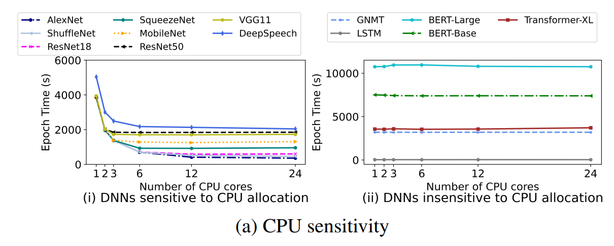

# (Synergy) Looking Beyond GPUs for DNN Scheduling on Multi-Tenant Clusters

Synergy 是一个**资源敏感的，round-based 的多租户 GPU 集群资源调度器**，支持**集成到多类调度策略** (e.g., LAS, FTF)，使用 **optimistic profiling 来获取 job 对其他资源 (CPU, 内存) 的敏感性信息** (部分 jobs 能从高于 GPU 数目成比例的其他资源分配中获利，部分 jobs 则不会受低于该比例其他资源分配的影响)，通过一个**近似最优的在线调度算法 Synergy-TUNE**，实现**多类资源 workload-aware 分配**，且保证所有 jobs 性能不差于 GPU-proportional share (其他资源的划分和 GPU 划分成比例)。Synergy 被限制在: 1) 同构集群；2) job GPU allocation 固定；3) 使用 MinIO cache.

-------

### 1. Motivation

- 现有调度器将 GPU 视为主要资源，CPU 和内存等其他资源则和 job 所需 GPU 数目成比例，没有考虑 job 对其他资源的敏感性。

- 将数据从 storage 读取到内存，并在 CPU 中预处理是计算昂贵的，导致 data stalls

- 通过减少部分不敏感 jobs 的其他资源分配，增加敏感 jobs 的其他资源，来缓解敏感 jobs 的 data stalls，提高集群吞吐

- **GPU-proportional allocation**: 例如，一个 server 有 4 个 GPUs，16 个 CPUs 和 200GB 内存，若一个 job 请求 1 个 GPU，则给它分配 4 个 CPUs 和 50GB 内存

- **CPU Sensitivity**: 

    - 大多数 image 和 speech models 对 CPU 分配敏感
    - 大多数 language models 对 CPU 分配不敏感，原因是输入数据预处理需求较低

    

- **Memory Sensitibity**: 

    - Language models 几乎不受内存分配大小的影响 (只要能保证训练正常进行不报错)，原因是，它是 GPU compute bound 的，若内存中没有 data 从 storage 中 fetch 不会影响训练吞吐；
    - Image 和 speech models 则会从更大的 DRAM caches 中获利，其从 storage 中 fetch data 的开销相对计算而言较大，导致 fetch stalls

- Insight: **尽量将 CPU/memory-sensitive 和 CPU/memory-insensitive 的 jobs 在 server 中 co-locate**，以更好地共享资源，提高吞吐

--------

### 2. Workflow

(1) 使用 **optimistic profile** 获得 job **resource sensitivity matrix**，进而获得其 **demand vector** (GPU, best-case CPU & 内存)；

- Step 1: 假设已分配最大内存，profile 不同 CPU 分配下的 job 吞吐
- Step 2: 分析并评估所有 CPU 和内存组合下的吞吐
- Insight: 内存分配上 job 性能的可预测性 (使用 DNN-aware caching，例如保证特定 cache hit rate 的 MinIO).

(2) 使用**给定的调度策略**和 **profile 结果**，在当前轮次中**识别可运行的 jobs** (GPU demand 不超过可用额度)；

(3) 使用一个**近似最优的启发式算法** (负责**资源划分** + **packing**)，将这些 jobs 沿多个不同的资源维度 (per-server 不同的资源划分) pack 到可用 servers 上。

- 注意，Synergy 仅关注其他辅助资源 (CPU, 内存) 的分配，job 的 GPU 分配作为 user input 不加修改

------

### 3. Scheduling Mechanism

- Pack 一个有多维资源需求的 job 等价于多维 bin packing problem (NP-hard)，因此先通过一个贪心方法作为估计.
- **Synergy-GREEDY**: **first-fit 策略**，依次选 runnable job，顺序遍历放在第一个能满足资源需求的 server，若不存在这样的 server，则跳过并继续为下一个 job 分配。
    - 注意，Greedy 在选的时候是**根据 GPU 和其他资源需求静态匹配**的，不会尝试降低其他资源需求来 check，因此会错失部分 job match 到 server 的机会
    - 可能导致 jobs 消耗完其他资源 (对于多分配会提高性能的 jobs)，而 GPU 资源未利用或碎片化 (贪心方法的通病)；会损害调度策略本身的 fairness (导致部分 jobs 一直轮不上)
- **Synergy-OPT**: 整体性能的上界。使用两层 LP 实现：
    - 第一个 LP 是假设单 machine，**最大化吞吐**；
    - 第二个 LP 是多 machines 下**最小化被跨机器分布的 jobs 的个数** (为了降低通信开销)。
- **Synergy-TUNE**: 
    - 规则：
        - **单 GPU job 的所有资源必须在相同 server**；
        - **多 GPU 分布式 job 的资源可以在相同 server，也可以跨 servers**。若跨 servers，则 **CPU 和内存必须和 GPU 划分成比例** (因为每个 GPU 上的任务类似，若不成比例则会造成短板效应，注意这些任务的模型都相同，因此不存在 data loading 和 pre-processing 需求量的差异)。
        - Synergy-TUNE **仅考虑 GPU demand 是否能被满足**，作为 job 是否 runnable 的标准，因为**其他资源量都是可动态调整的** (与 Greedy 不同)。因此不会导致 GPU 的低利用率。
    - 流程：
        - 根据 runnable jobs 的 GPU 需求，CPU 需求和内存需求**排序**，**贪心地顺序 pack jobs**，寻找剩余资源最少但正好能满足 demand vector (GPU, best-case CPU & 内存) 的 server 来放置；
        - 若某个 job 没有 server 可以放，则将其 demand **降为 GPU-proportional share 并重试**；
        - 若还是不行，则不考虑其他资源需求，**仅考虑 GPU 需求地找一个 server**，该 server 上的其他 jobs 肯定是高于 GPU-proportional 的 (否则前一步就不会放不下了)，**将这些 jobs 降为 GPU-proportional**，这样新来的 job 就能放下了；
    - **最坏情况下，所有 jobs 都以 GPU-proportional share 来运行**，因此 Synergy 可以保证所有 jobs 的性能不差于 GPU-proportional 时的性能
        - 不考虑此时还不能运行的 jobs，因为是跟 GPU-proportional 比较
