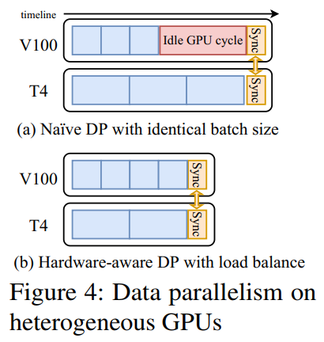
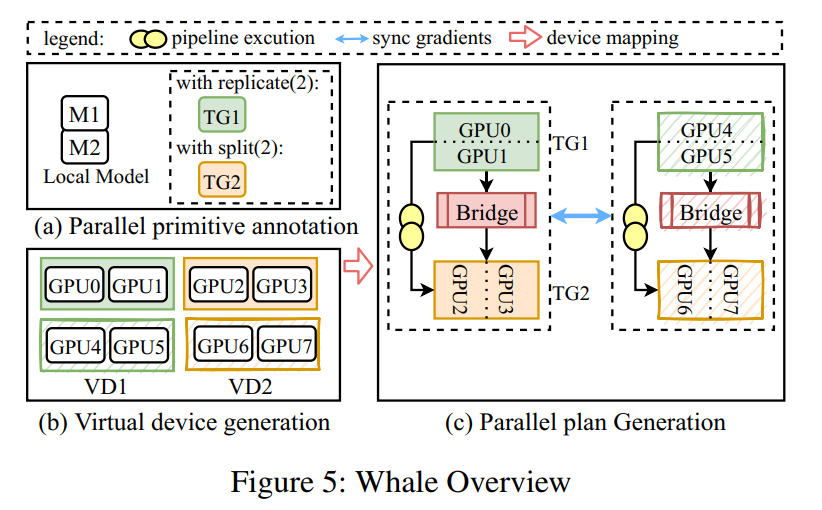
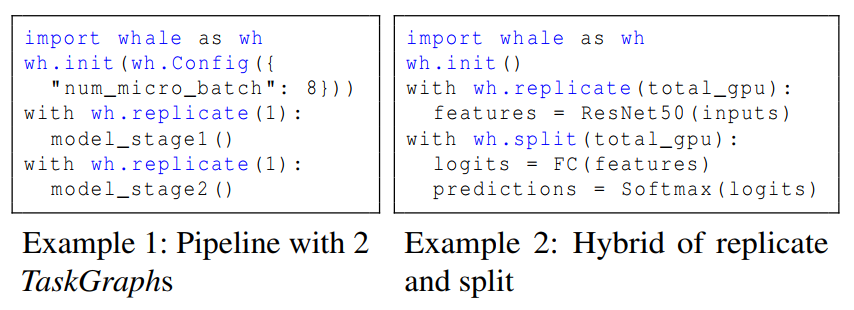
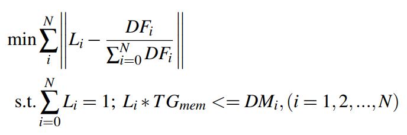

# Whale: Efficient Giant Model Training over Heterogeneous GPUs

Whale 是一个**通用高效的大模型分布式训练框架**，通过定义两个 model annotation 形式的 primitives，同时支持 **user hints 定义混合并行**和**基于 num_task_graph 和硬件信息定义混合并行**。注意，前者需要**在 code 中人工划分 Task Graph (TG)，并分别标注并行方式**；后者仅实现了 **Task Graph 内部 group ShardingUnit 并顺序匹配通信开销最小的 predefined parallelism pattern**，以及 **hardware-aware 探索 uneven parallelism** (即 intra-TaskGraph load balancing)，并未考虑如何将 model 划分为 num_task_graph 个 TG。

基于 model annotations (user hints / automatically generated)，Whale 通过 **hardware-aware loading balancing** 进行考虑异构的调整，包括 **intra-TaskGraph** (最小化 TG 内的空闲时间，通过和设备算力成比例地平衡负载来实现 (考虑内存限制，replicate 则调整各 replica 的 bs，split 则 uneven partition)，考虑内存的算法核心是将 OOM 设备上的负载迁移到内存未超出限制且负载最低的设备上) 和 **inter-TaskGraph** (earlier TG 放在内存更大的 VirtualDevice (VG) 上，应用上述考虑内存的算法来处理某些 later TG 可能包含过大 layer 的情况)。

----

### 1. 硬件异构性对并行方式的影响

-----

### 2. Architecture

---------

### 3. Programming Interface

------

### 4. Objective Function in Intra-TaskGraph Loading Balancing

最小化 sum(|设备 i 上 load 的比例 - 设备 i 算力占全部算力的比例|)，在 i 内存限制的约束下。
