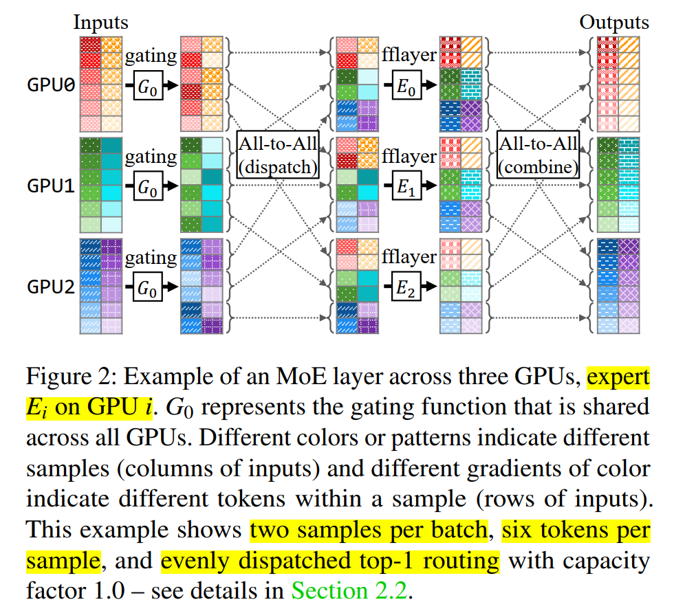

# TUTEL: Adaptive Mixture-of-Experts at Scale

背景：MoE 的动态特性和系统的静态并行/ pipeline 方式不匹配，限制了大规模 MoE model 的实现

TUTEL 是一个**高可扩展的 MoE 全栈系统**，实现了 **MoE model** 实时的**自适应并行策略** (高效的 expert 执行，基于 cost function 动态决定并切换并行策略 (Expert parallelism, DP, MP)，单个 expert <- 多 GPUs) 和**自适应 pipeline 策略** (高效的 MoE dispatch 和 combine，利用 multi-stream 将 tokens 沿 batch 维度切得更细，进而在通信 stream 和计算 stream 间进行 pipeline，并离散化 capacity factor f 的取值，以减少 workload 动态变化 (f 相应变化) 导致需要重新搜索最优时间的 pipeline 策略的次数)；同时，TUTEL 还包括一个**用来加速 MoE 通信的二维多级 all-to-all 算法** (多个小 data chunks 聚合成一个大 data chunk group 一起发，利用 **stride memory copy (消除非连续内存访问带来的额外延迟)** 来将 GPU 上目标 GPU / node (分两次 align) 相同的 chunks align 成为一个 group，提高 intra-node GPU 通信网络利用率，且保证除最后一步 inter-node all-to-all 之外前面步骤与总 GPUs 数目无关 (通信延迟不随规模增大而上升)，仅与 node 内 local GPUs 数目有关，保证了可扩展性；inter-node 不变)，以及一个 **flexible all-to-all 算法** (reshape tensor shape 让某些 operator 算得更快)。

-------

### 1. Introduction

- MoE 的动态特性：一个 MoE layer 由多个分布在不同 GPUs 上的并行 experts 组成，而每个 expert 的 workload 是无法确定的，依赖于输入和 gate 函数，进而不断改变。

    - 上述动态特性导致 MoE experts 经常无法采用性能最优的并行和 pipeline 策略，因为最优策略一直在动态变化。

    - 动态实时调整并行和 pipeline 策略并不容易，会造成高延迟和 GPU 显存开销；同时，还需要对通信结构进行优化。

    - MoE 动态负载的原因：

        - Token routing 机制。动态，经常在 experts 间不均衡；

        - 动态 expert capacity。表征单个 expert 接收到的最大 tokens 数目，被定义为 k (from top-k) * f (容量因子) * T (每个 batch 内的 tokens 数目) / E (experts 数目)

    - **对 parallel 的结论**：自适应并行对提高不同配置下的 MoE 训练性能 (吞吐) 很有帮助，但并行策略间的切换开销很大
    - **对 pipeline 的结论**：
        - 静态 pipeline 使用静态 all-to-all 算法和固定的 pipeline degree，将 all-to-all (主要是跨 GPU 的内存拷贝，计算不密集) 和 expert (fflayer) 计算进行 pipeline (overlapping)，以提高利用率。然而，在不同 MoE 配置和规模下，静态策略不总能获得最优性能
        - 此外，GPU 上的计算和通信会产生相互干扰，影响获得最优 pipeline 策略，这是因为在相同  GPU 上同时运行 NCCL kernels 和 computation kernels 的干扰难以评估。实验表明，即使两个不同的 all-to-all 算法单独运行时吞吐相同，在引入相同 computation kernel 后吞吐也会显著不同
    - **对 intra-node 网络通信效率的结论**：
        - All-to-all 过程一般利用 NCCL 支持的 GPUs 间 P2P 通信 APIs，通信量为 model size / GPU nums。因此，当 scale out 扩大 GPU 数目时，通信量会显著下降，进而造成 high-speed links (e.g., NVLink, HDR InfiniBand) 的利用率下降。所以，在 MoE 模型面向的大规模 (GPU 数目多) 和小 workload (model 计算和通信稀疏) 场景中，all-to-all 通信很难适用。

- MoE basic: MoE 中的每个 sample 都要被分成一个或多个 tokens；
    - MoE Dispatch: 通过一个 all-to-all 的 collective 通信，决定每个输入 token 的目标 GPUs (一个或多个目标 GPUs，进行计算，每个 GPU 运行一个 expert)；
    - MoE Combine: 通过第二个 all-to-all 的 collective 通信，将每个 token 对应的输出发送回原来的 GPU；
    - MoE 的高 cost-efficiency: 在超大规模 DL 中，增加模型参数 (即增加 experts) 不会显著增加每个 token 的计算开销
    - 增大 experts 数目会在单个 expert 上带来显著的边际递减效应，因此大规模训练中仅采用远少于 GPU 数目的 experts 数目，且单个 expert <- 多个 GPUs

- 这里的将一个 sample 划分为多个 tokens 应该是适用于 NLP RNN 领域的，例如将一个长句子划分为多个短语，图 2 中 all-to-all 之后也不是将不同 samples 的不同 tokens 组合，只是利用 GPU 的多 sm 来分别并行计算而已

-------

### 2.Design

详见 Paper 中的相关注释。除了在本 README 最前面的总结部分中提到的核心 idea 外，具体的设计都挺 trivial 的。

仅给出 2DH All-to-All 算法的相关内容：

- 注意，**naive 方法**是先 intra-node 直接 all-to-all allreduce，每次发一个 S/n 的 data chuck (GPUs 间发送 data chunk 是线性的，即发完 chunk 0 再发 chunk 1)，一对 GPUs 间总共发 n / m 个 data chunks，发的时间更长，利用率低

- **2DH All-to-All 算法**：

    - 在每个 GPU 内用 stride memory copy (可以消除非连续内存访问的延迟) 来高效地将非连续但目标 GPU 相同的 data chunks align 到一起；
    - 在相同 node 的 GPUs 间进行 intra-node all-to-all，每对 GPUs 间的通信量为 S / m，交换一个 aligned data chunks group；
    - 同样在每个 GPU 上将非连续但目标 node 相同的 data chunks 用 stride memory copy align 到一起；
    - 在 nodes 间将第二次的 aligned data chunks group 进行 inter-node all-to-all，每对 nodes 间的通信量为 S / (n / m)，和 naive 方法相同。

    因此，该方法仅提高了 intra-node 的网络利用率，即 high-bandwidth intra-node links (NVLink for NVIDIA GPUs or Infinity Fabric Link (xGMI) for AMD GPUs)；inter-node 通信不变。
