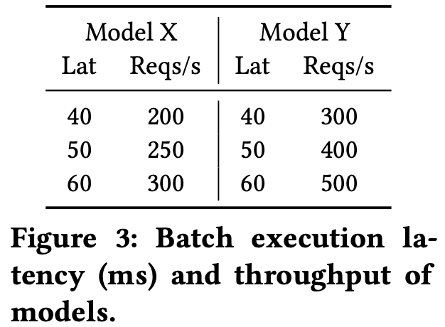
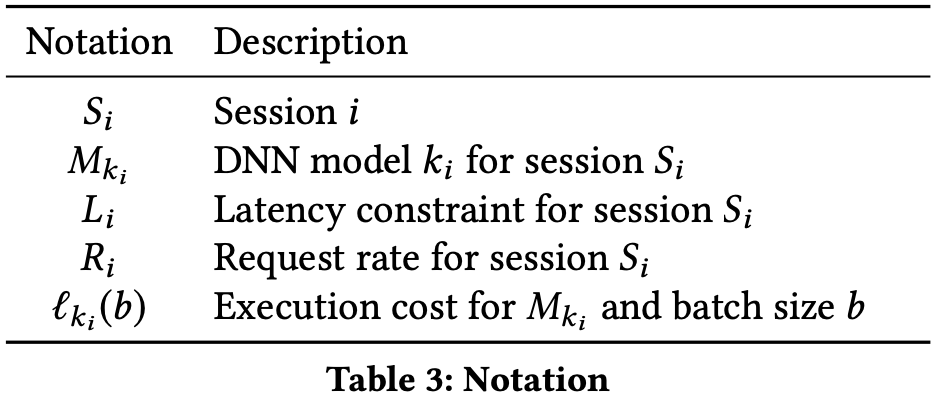

# 【论文赏读】Nexus: A GPU Cluster Engine for Accelerating DNN-Based Video Analysis

[[Ref] Nexus: A GPU Cluster Engine for Accelerating DNN-Based Video Analysis](https://dl.acm.org/doi/abs/10.1145/3341301.3359658)

----------

## 1. Abstract

- **目标**：在 GPU 集群中，以**低处理时延**、**考虑混布**的 DNN 服务调度，实现**高 GPU 利用率**。
- **性能**：
    - Nexus 在 99% 时间内满足 QoS 需求的条件下，能够处理 1.8 ~ 12.7 倍于其他系统的访问频率；
    - 长时间运行的多应用程序部署保持在最佳利用率的 84% 以上，并且在 100 个 GPU 集群上，仅 0.27% 的请求违反了 QoS 限制。

-----------

## 2. Introduction

- 首先，作者提出了一个基本的问题：**如何同时满足高利用率和可接受的时延？**

    > A fundamental problem, therefore, is to distribute the large incoming workload onto a cluster of accelerators at high accelerator utilization and acceptable latency.

    毫无疑问的是，鱼和熊掌不可兼得，高利用率和低时延在分配决策中是冲突的，因此必须选择以某一个方向为主。作者将该问题考虑成如何通过分布式的前端将输入分片到后端 GPU 上，并提出了几点使得该问题更加复杂的因素：

    1. **相同 GPU 上多 NN 的混布**：选择并调度 NN，以在满足 QoS 限制的同时最大化共同吞吐；
    2. **许多应用由相互反馈的 DNN 组构成**：识别这些 DNN 组，并以组为单位进行整组调度和执行；
    3. **以批（batch）的方式组织 DNN 输入会使计算更加高效，但batching 会造成调度更加复杂化**：跨租户、跨请求的协调 + 强制底层调度算法考虑批大小
    4. **迁移学习导致的网络特异化**，但批处理仅能在相同模型的情况下带来好处

- 接着，作者正式介绍了 Nexus 的相关内容。**Nexus 是一个用于 DNN 执行的 GPU 集群，它解决了上述的问题，以在时延 SLO 的约束下获得高执行吞吐量**。Nexus 主要是用了三项技术：

    1. ***Batching-aware scheduler***：针对可变的 batch size，对不同的 batch 执行 bin packing 调度。该 scheduler 会指定 1) **所需的 GPU**；2) **DNN 在 GPU 之间的分布**；3) **DNN 的执行顺序**。

        > First, it relies on a novel batching-aware scheduler (Section 6.1) that performs bin packing when the balls being packed into bins have variable size, depending on the size of the batch they are in. 

    2. ***Query analysis***：Nexus 允许将相关 DNN 调用组编写为**查询（queries）**，并提供**自动查询优化**以将最佳批量大小**在线地**分配给查询的组件。

    3. ***Batching of networks with different BS***：Nexus 允许**部分**不同批大小的网络进行 batching，这允许了特异化网络之间共同的批处理。

    在实现上，Nexus 已被完全实现为可部署在商业云上的容器化系统，包含大约 10k 行 C++。

-----

## 3. Background

- 作者在 2.1 节通过实验表明，为了节约 cost，必须要维持 GPU/TPU 计算容量的高利用率。随后指出，**没有单个流，甚至大多数应用程序都无法产生足够高的访问速率，来保证上述高利用率**。

    > No single stream, or even most applications, can yield such rates.

    为了解决上述问题， **Nexus 通过聚合跨流、跨应用程序的输入，为每个加速器提供足够的工作**。然而，作者随后又指出，仅提供足够的工作并不能达到高利用率，还必须**将合适类型的工作分组并放置到合适的计算资源**。

- 在 2.2 节中，作者首先说明 DNN 的 layers 是计算密集的，且大小从 1 MB 到几百 MB 不等。之后，作者通过两点事实进行分析：

    1. **加载模型到内存的 cost 不可忽视**（将消耗几百毫秒到几秒的时间）。因此，在为大量 DNN 提供服务时，通常必须将 DNN 放置在特定的 GPU 上，方法是将其预加载到 GPU 内存中，然后在许多后续调用中重新使用它。因此，必须进行有效的 *packing*，决定哪些模型应该在哪个 GPU 上混布，以及如何调度来最小化干扰。

    2. **kernel（layers）达到的处理器利用率主要取决于批处理**。与没有批处理相比，批处理允许内核通过对每个加载的输入进行多次操作来避免内存访问停滞。根据经验，作者**通过线性模型来拟合批处理的时延**：
        $$
        \text{batch\_lat}(b) = \alpha b + \beta
        $$
        其中，$\beta$ 是激活模型的固定 cost，$\alpha$ 是 batch 中每个额外任务的 cost。**大的 batch 均摊了固定 cost 以达到更高的吞吐**。

        尽管批处理对利用率至关重要，但它使集群内的资源分配和调度决策变得复杂。同时，迁移学习带来的模型特异化也限制了批处理的使用。

----

## 4. Related Work

- **Scale**：Nexus 提供机器以扩展服务于大型、不断变化的工作负载。
- **Expressivity**：Nexus 提供了一种查询机制，该机制 (a) 允许联合指定相关的 DNN 执行任务，并且 (b) 允许用户仅在整个查询级别指定 latency SLO。然后 Nexus 分析查询并将 QoS 需求和 batch 大小分配给组成的 DNN 任务，以最大限度地提高整个查询的吞吐量。
- **Granularity**：Nexus 自动识别模型的常见子图并批量执行它们。这对于在专用模型上进行批处理至关重要，这些模型通常共享除输出层之外的所有层。

- 许多工作都集中在以较小的精度损失生产更快的模型，可以组合不同精度的模型以保持高精度和性能。**Nexus 认为模型的优化、选择和组合最好由应用程序完成，并且不为这些功能提供特殊支持**。

---

## 5. Scheduling Problems in Batched Execution

###### Insights

1. 从根本上说，在 GPU 上打包模型的算法需要考虑到输入的处理成本是"糊状的”（squishy）这一事实。例如，**成本随处理该输入的批次的大小而变化**。此外，**执行的延迟还取决于批量大小**。 —— Squishy bin packing

    > Fundamentally, the algorithm for packing models on GPUs needs to take into account the fact that the processing cost of an input is “squishy”

2. **批处理使查询处理复杂化**。如果将某个 latency SLO 作为一个整体分配给查询，则系统需要在构成查询的 DNN 调用之间划分延迟，以便每个 latency split 允许相关 DNN 调用的高效批量执行。 —— Complex query scheduling

3. 除了批处理感知资源分配之外，**运行时调度引擎还必须确定哪些请求被批处理以及在突发到达期间丢弃哪些请求**。 —— Rate control and adaptive batching

----------

- METHOD 1: ***Squishy Bin Packing*** —— **如何调度 DNN 任务以满足 latency SLO**

    - 通过 **batching profile** 获得不同模型在不同 batch size 下的 latency 和 throughput，并判断在不违背 latency SLO 的前提下使用最大的 batch size 以最大化 throughput。如 Figure 2(a) 所示，**当吞吐较大时，不同的模型在多个 GPU 上分别并行执行**。

        

    - 接下来考虑模型的吞吐较低的情况，每个模型需要少于一个 GPU。此时，调度器需要**将多个 DNN 任务放在同一块 GPU 上，通过 RR 轮转方法执行**。时间片 duty cycle 的长度固定为所有模型、所有 batch size 的最大 latency。注意，此时最坏情况下的 latency 不再是 batch execution cost 的两倍，而是 duty cycle 和该任务类型的 batch execution time 之和。

    

    - **通过判断两个 DNN 任务在一起时的 1) reqs/sec；2) latency，来判断两个任务是否可以混布**。在 Figure 2(b) 中，Model A、B、C 各自需要的吞吐分别为 64 reqs/sec、32 reqs/sec、32 reqs/sec，设置 Model A 的任务为 batch size = 8 以满足其吞吐需求，对应的 latency 为 75 ms；此时，我们需要设置 Model B 和 C 的 batch size 为 4 以满足各自的吞吐需求。对于 Model B，有 50ms + 75ms < 125ms (length of duty cycle) 以及 (125ms + 50ms) < 250ms (latency SLO)，因此 B 的任务可以和此情景下的 A 混布；相同的计算方法可知 C 不能与这里的 A 混布。
    - **上述优化问题不能通过已知的调度算法解决**。原因是：1)  batch size 可变，试图将多个任务放入同一个 GPU；2) 在 GPU memory 等限制之外，还存在 latency SLO 的限制；3) 调度的生成有很多自由度，与模型执行相关的 batch size 不仅是请求率的函数，而且是嵌入批处理的占空比的函数。

- METHOD 2: ***Complex Query Scheduling*** —— **如何切分应用程序级别的 latency SLO 到每个调用的模型上**

    - **应用程序通常包含多个 DNN 模型的相关计算**。我们一般设置应用程序级别的 latency SLO，但由于其调用的 DNN 模型会分布在不同的节点上，必须为分别它们生成新的 latency SLO。

        

    - 假设某个应用程序依次调用了 Model X 和 Y，Model X 的输出作为 Y 的输入，且整体的 latency SLO 为 100ms。每个 X 的输入平均会获得 $\gamma$ 个输出。 则按照 Figure 3 所示，lat_X = 40ms 和 lat_Y = 60ms 能获得最大的共同吞吐。然而，一个更加详细的实验将揭示有趣的现象。

    - 假设 Model X 占用了 $p$ 个 GPUs，Y 占用了 $q$ 个，则我们有：
        $$
        \gamma \cdot p \cdot T_X = q \cdot T_Y
        $$
        其中 $T_X$ 和 $T_Y$ 分别为 X 和 Y 的每 GPU 吞吐。上述等式在 pipeline 不会被任何模型阻断的情况下成立。我们定义平均吞吐为 $p \cdot T_X / (p + q)$。Figure 4 表明，**latency split 的好坏收到 $\gamma$ 的影响，且会随着时间改变**。

        

        复杂查询的 latency split 会影响整体效率，因此**有必要同时考虑批处理性能和工作负载统计信息以做出最佳决策**。**Latency split 不应该是静态的，而是随着时间的推移根据当前工作负载进行调整**。

- METHOD 3: ***Rate Control and Adaptive Batching*** —— **如何自适应地进行批处理**

    - **模型服务系统需要根据收到的请求数量进行自适应批处理**，即需要丢弃某些 requests，来在 latency SLO 内服务其他的 requests。一种方法是 Clipper 采用的 *Lazy Dropping*，即仅当超过 ddl 时丢弃 request，同时根据 queue 中某一 model 最早的 request 的 time budget 来决定该 model 对应 task 的 batch size。然而，作者通过实验表明该方案在 fixed cost $\beta$ 很大，extra cost $\alpha$ 很小，泊松分布模拟 workload，依据公式 $\text{batch\_lat}(b) = \alpha b + \beta$ 的时候会造成很大的 request missing，原因是由于系统总是尝试执行最早收到的请求，它通常不得不使用小 batch 以满足最后期限，高昂的 fixed cost 并没有被很好地均摊。
    - 这个实验表明，**即使是运行时也需要考虑批处理效率来确定要分派的任务**。

------

## 6. Nexus Architecture

- Previous Settings：可以丢弃某些超过 ddl 的 request，这也是 video analysis 的特性；可以推迟超过 ddl 的 request 的执行并降低它们的优先级。

    

- ***Management Plane***：允许开发人员在数小时到数周的时间范围内获取和部署应用程序和模型。

    - 模型存储在**模型数据库**中，并可能附带样本数据集或 batch profile 文件。
    - **应用程序**是向客户端程序提供 Nexus Library 的容器。

- ***Control Plane***：**全局调度器**是一个集群范围的资源管理器，它使用来自运行时的负载统计信息。

    - 使用 profile 信息在集群中添加或删除前端和后端节点。

    - 激活 **Epoch Scheduler** 以决定执行哪个模型，batch size 的大小，以及放置在哪个后端上，以平衡负载并最大化利用率。当多个模型被分配在同一个后端时，使用**执行调度**来尽可能减少干扰。

    - 通过**路由表** routing table 来存储模型到后端的映射，并发送到前端；相应的执行调度存储在**调度信息**中被发送到后端

    - **分配、调度和路由更新发生在一个 epoch 的粒度上，通常是 30-60 秒，尽管新的 epoch 也可以由工作负载的大变化触发**。

    - Epoch scheduling 由以下几个部分组成：

        - **为 query 中的各个模型生成 latency SLO 的 split** —— Scheduling complex queries
        - **将两个或多个共享前缀和 latency SLO 的模型组合成一个新的前缀批处理模型** —— Batch-aware dispatch
        - **执行 profile 引导的 quishy bin packing 为每个模型分配 GPU 资源** —— Scheduling streams of individual DNN tasks

        注意，由于 **epoch scheduling 以 epoch 为粒度应对负载变化**，因此 Nexus 依赖于丢弃过期的 requests，以确保大多数请求可以在其延迟限制内得到服务。

- ***Data Plane***：**当用户请求进入应用程序容器（的副本）时，应用程序通过 Nexus library API 调用 DNN**。

    - Nexus library 会查询本地的路由表，为模型找到一个合适的后端，并返回响应
    - 后端模块会使用多线程来 queue requests，按照执行调度的顺序选择、执行 DNN 模型，并返回结果给前端

-----

## 6. Batch-aware Scheduling and Dispatch

- ***Scheduling Streams of Individual DNN Tasks***：该调度问题为 bin packing 问题，但需要额外解决任务的 squishiness 并满足 latency SLO。

    - 输入：将对给定模型的 requests 和相应的 latency SLO 称为**会话** session；

        

    - Scheduling Overview：

        - 调度程序为每个 GPU 分配一个或多个会话并指定它们的 batch size。
        - 每个 GPU 节点 n 通过轮转来在 duty cycle $d_n$ 内、batched mode 下执行每个模型的 invocations。
        - 对于有足够多 requests 的会话，一个或多个 GPU 节点被分配给单个会话。
        - 对于剩余的 workload，一个整数规划方案（实际没用）或一个贪心估计算法被使用，以尝试解决较小会话中的 bin packing 问题。

    - **Scheduling Large Sessions**：

        - $M_{k_i}$ 的 isolated peak throughput 是 $T_i = B_i / \ell_{k_i}(B_i)$，注意，这里实际上是假设了 request 之间的 overlap 完全消除了 queue time 的影响。其中， $B_i$ 是满足 $2 \ell_{k_i}(b) \leq L_i$ 的最大 $b$ 值。 分配的 GPU 节点数目是 $n = \lfloor R_i / T_i \rfloor$。上述方法会导致部分 workload 的剩余。

    - **Scheduling Residual Workload**：会话中的模型都没有足够多的 load 来请求一块完整的 GPU。

        - 整数优化方案：NP hard 问题，时间复杂度太高，不使用

        - **贪心估计算法**： 在 bin packing 的过程中，调度器首先单独检查每个剩余会话，计算最大 batch size 和相应的 duty cycle，以满足吞吐量和 SLO 需求。

            - 为了提高利用率，调度器接下来尝试将多个会话**合并**到一个 duty cycle 中，以占用率降序的顺序。

                

            - 假设 $r_i $ 是一个剩余 load 的 request rate，其 batch size 为 $b$，则 duty cycle $d = b/r_i$，最坏情况下的 latency 是 $d + \ell_{k_i}(b)$。我们有约束：
                $$
                d + \ell_{k_i}(b) = b / r_i + \ell_{k_i}(b) \leq L_i
                $$
                我们寻找能满足上述约束的最大 batch size $b_i$，则 $d_i$ 也同样取到了最大值。定义**占用率** occupancy 为：$occ_i(b_i) = \ell_{k_i}(b_i) / d_i$。

            - 在一次合并中：$d = \min(d_1, d_2)$，假设 $d = d_2$。$S_1$ 新的 batch size 是 $b_1' = d \cdot r_1 \leq b_1$。最坏情况下的 latency 变成了 $d + \ell_{k_1}(b_1') \leq d_1 + \ell_{k_1}(b_1) \leq L_i$，因此**该合并操作并不会违反 $S_1$ 的 latency SLO**。如果能满足 duty cycle，即 $\ell_{k_1}(b_1') + \ell_{k_2}(b_2) \leq d$，且 memory 容量合适，则该合并合法。

- ***Scheduling Complex Queries***：提出用于应用 queries 的数据流表示的 query analysis 算法，以确定各子模型的 latency SLO splits。

    

    - Query analysis 提取应用代码中模型调用之间的**数据流依赖图**。将上述过程提取成一个优化问题：

        - 目标是为各模型找到最好的  latency SLO split $L_i$，来最小化需要的 GPU 数目，等价于寻找最好的 batch size $b_i$，同时在从根节点到叶节点的路径中满足 latency SLO：
            $$
            \mathop{\text{minimize}}\limits_{\{b_v\}} \sum_v R_v \ell_v(b_v) / v_v\\
            
            \text{subject to} \sum_{u: M_{root} \rightarrow M_v} \ell_u(b_u) \leq L \ \ \ \forall v \in \text{leaf}\\
            $$

        - 使用**动态规划**来求解上述优化问题。令 $f(u, t)$  表示模型 $u$ 在 time budget 为 $t$ 下所需 GPU 的最少数目，对于一个非叶节点 $u$，算法给 $u$ 分配了 $k$ 的 time budget，而 $u$ 的子树最多只有 $t-k$。随后，算法**枚举**寻找最佳 $k$ 的数值：
            $$
            f(u,t) = \min _{k: k \leq t} \{ \min_{b: \ell_u(b) \leq k} R_u \frac{\ell_u(b)}{b} + \min_{t': t' \leq t-k} \sum_{v: M_u \rightarrow M_v} f(v, t') \}\\
            $$
            由于动态规划无法处理连续状态空间，我们将 time budget 的状态空间估计成 $L / \varepsilon$ 个小段。

- ***Batch-aware Dispatch***：描述控制后端节点上 DNN 任务执行的运行机制，这些方法类似于 tricks。

    - Overlapping CPU and GPU Computation：CPU 和 GPU 之间的混叠
    - GPU Multiplexing：GPU 复用
    - **Prefix Batching**：迁移学习总是将一个模型从一个任务移到另一个任务，仅重新训练最后几层。若模型之间存在任何一层不用，则不能将它们的输入在一起组成 batch。但是，**几个模型可能仅在其输出层上有所不同**。**批处理除输出层之外的所有层可以产生可观的批处理收益**。
        - Nexus 计算模型模式的每个子树的哈希值，并将其与数据库中的现有模型进行比较，以在模型上传时识别常见的子树。
        - 在运行时，具有已知公共子树的模型部分加载到后端，并以子树（或前缀）粒度进行批处理。然后依次执行不同的后缀部分。
    - **Adaptive Batching**：Nexus 用了 *Early Drop* 来跳过会导致次优批处理的请求。调度程序使用滑动窗口扫描队列，滑动窗口的长度是由某个会话的 global scheduler 决定的。
        - 它在第一个有足够 time budget 用于整个窗口的批量执行延迟的请求处停止，并丢弃所有早期请求。

----

## 7. Evaluation

待续。

